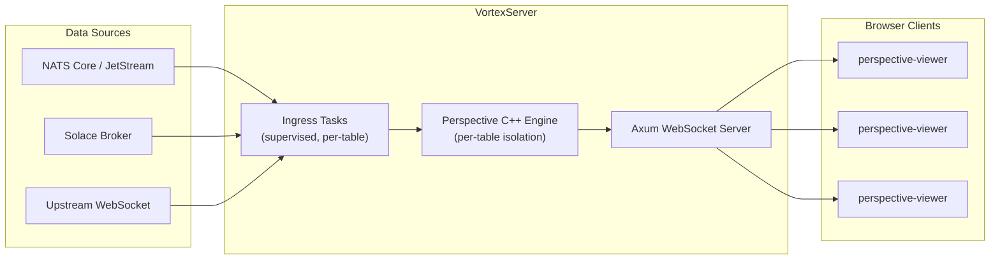
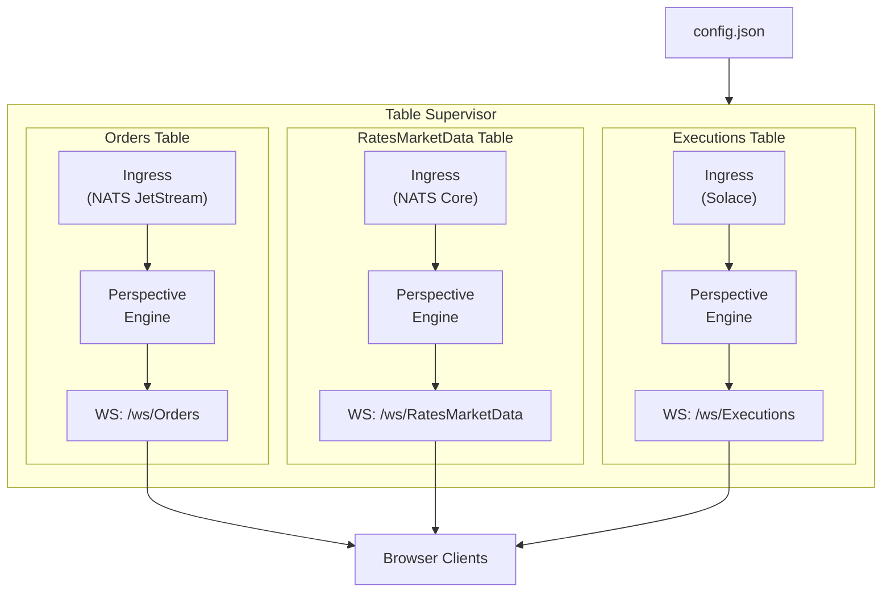
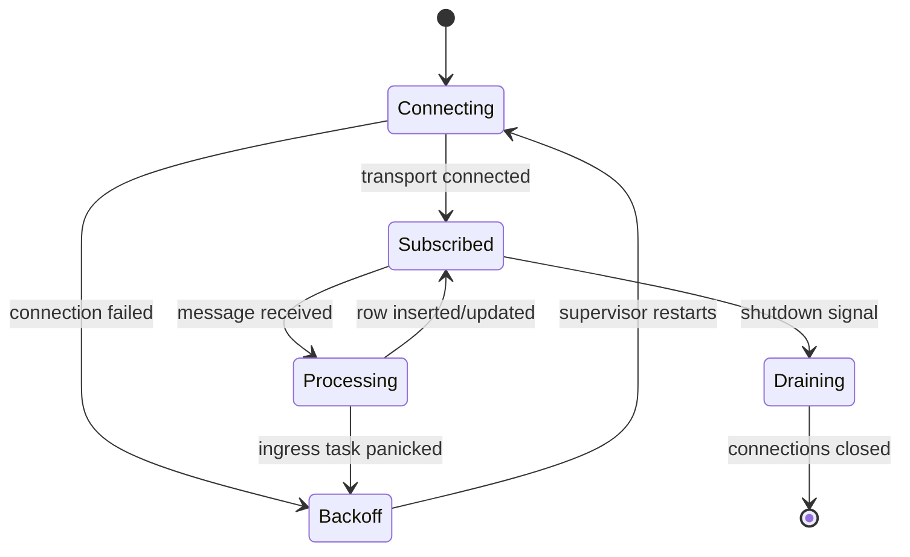

# VortexServer

High-performance WebSocket server for real-time data visualization, built on [Perspective](https://perspective.finos.org/) and [Axum](https://github.com/tokio-rs/axum).

VortexServer ingests streaming data from multiple transport protocols (NATS, Solace, WebSocket) and serves it to browser clients via `<perspective-viewer>` over WebSocket. Each table runs on an isolated C++ analytics engine instance with automatic supervision and restart.

## Features

- **Multi-transport ingress** — NATS Core, NATS JetStream, Solace, and upstream WebSocket
- **Per-table isolation** — each table gets its own Perspective engine and FFI mutex
- **Supervised ingress** — panicked ingress tasks auto-restart with backoff
- **Graceful shutdown** — Ctrl+C / SIGTERM drains connections cleanly
- **Structured logging** — JSON or pretty format, optional rotating file output
- **JSON configuration** — single config file with environment variable overrides

## Prerequisites

| Tool | Version | Notes |
|------|---------|-------|
| **Rust** | nightly-2026-01-01 | Set automatically via `rust-toolchain.toml` |
| **Conan** | 2.x | `pip install conan` |
| **CMake** | 3.20+ | Required for C++ build |
| **C++ compiler** | C++17 | Xcode (macOS), GCC (Linux), MSVC (Windows) |

## Quick Start

```bash
# 1. Clone
git clone https://github.com/CapitalMarketsMacro/VortexServerRust.git
cd VortexServerRust

# 2. Build (first run builds C++ dependencies via Conan — ~15-20 min, cached after)
cargo build

# 3. Copy and edit configuration
cp config.example.json config.json

# 4. Run
cargo run -p vortex-server
```

The server binds to `0.0.0.0:4000` by default. Connect a Perspective viewer:

```javascript
const viewer = document.querySelector("perspective-viewer");
const ws = new perspective.WebSocketClient("ws://localhost:4000/ws");
const table = await ws.open_table("Orders");
await viewer.load(table);
```

## Configuration

VortexServer uses a JSON config file (default: `config.json`). Override the path via CLI or environment variable:

```bash
cargo run -p vortex-server -- --config path/to/config.json
# or
VORTEX_CONFIG=path/to/config.json cargo run -p vortex-server
```

### Example Configuration

```json
{
  "server": {
    "bind": "0.0.0.0:4000",
    "ws_path": "/ws"
  },
  "logging": {
    "level": "info,async_nats=warn",
    "format": "pretty",
    "dir": "logs",
    "file_prefix": "vortex-server"
  },
  "transports": {
    "nats": {
      "url": "nats://localhost:4222",
      "name": "vortex-server",
      "credentials_file": null
    },
    "solace": {
      "host": "tcps://broker.example.com:55443",
      "vpn": "default",
      "username": "vortex",
      "password": "REPLACE_ME",
      "client_name": "vortex-server"
    }
  },
  "tables": [
    {
      "name": "Orders",
      "index": "OrderId",
      "source": {
        "transport": "nats_jetstream",
        "stream": "ORDERS",
        "subject": "orders.>",
        "consumer": "vortex-orders",
        "format": "json_row"
      }
    }
  ]
}
```

### Server

| Field | Default | Description |
|-------|---------|-------------|
| `bind` | `0.0.0.0:4000` | Address and port to listen on |
| `ws_path` | `/ws` | Base path for WebSocket endpoints |

### Logging

| Field | Default | Description |
|-------|---------|-------------|
| `level` | `info` | [tracing filter](https://docs.rs/tracing-subscriber/latest/tracing_subscriber/filter/struct.EnvFilter.html) string |
| `format` | `pretty` | `pretty` or `json` |
| `dir` | — | Directory for rotating log files (omit to disable file logging) |
| `file_prefix` | `vortex-server` | Log filename prefix |

### Tables

Each entry in the `tables` array creates a Perspective table exposed at `{ws_path}/{name}`.

| Field | Description |
|-------|-------------|
| `name` | Table name (becomes the WebSocket endpoint) |
| `index` | Primary key column for upserts |
| `composite_index` | Array of columns forming a composite primary key |
| `stringify_columns` | Columns to treat as strings regardless of inferred type |
| `source` | Ingress configuration (see transports below) |

### Transport Types

**NATS Core** — subscribe to a subject on a NATS server:
```json
{ "transport": "nats_core", "subject": "rates.marketData", "format": "json_row" }
```

**NATS JetStream** — durable consumer on a JetStream stream:
```json
{ "transport": "nats_jetstream", "stream": "ORDERS", "subject": "orders.>", "consumer": "vortex-orders", "format": "json_row" }
```

**Solace** — subscribe to a Solace topic:
```json
{ "transport": "solace", "topic": "executions/>", "format": "json_row" }
```

**WebSocket** — connect to an upstream WebSocket feed:
```json
{ "transport": "websocket", "endpoint": "wss://feed.example.com/ticks", "format": "json_row" }
```

## Architecture

### Data Flow Overview



### Per-Table Isolation

Each configured table runs as an independent pipeline with its own engine instance, ingress task, and supervisor. A failure in one table does not affect others.



### Ingress Lifecycle



## Project Structure

```
src/main.rs                — VortexServer application entry point
Cargo.toml                 — Workspace root + vortex-server package
config.example.json        — Example configuration
rust-toolchain.toml        — Pinned nightly toolchain
Vortex/                    — Perspective engine (C++ + Rust bindings)
  crates/
    perspective/           — Facade crate (re-exports client/server, Axum WS handler)
    perspective-client/    — Protocol definitions (protobuf), Arrow types, Client/Session/Table/View
    perspective-server/    — C++ engine bridge (FFI, build.rs + CMake + Conan)
  examples/axum-server/    — Standalone example with simulated Treasury bond data
  build.sh / build.bat     — Full C++ + Rust build scripts
```

## Build Commands

```bash
# Full C++ + Rust build (first run ~15-20 min due to Conan; cached after)
cd Vortex && ./build.sh      # Linux/macOS
cd Vortex && build.bat       # Windows

# Rust-only rebuild (after C++ is already built)
cargo build

# Release build (optimized for size: LTO, stripped symbols)
cargo build --release

# Run the server
cargo run -p vortex-server

# Run the example (simulated Treasury bond data)
cargo run -p perspective-axum-example

# Run tests
cargo test

# Format and lint
cargo fmt
cargo clippy
```

## Platform Support

| Platform | Architecture | Status |
|----------|-------------|--------|
| macOS | ARM64 (Apple Silicon) | Supported |
| macOS | x86_64 | Supported |
| Linux | x86_64 | Supported |
| Windows | x86_64 | Supported |

C++ dependencies are downloaded as pre-built binaries via Conan 2 where available. The Conan default profile is auto-detected on first build.

## License

Apache-2.0
