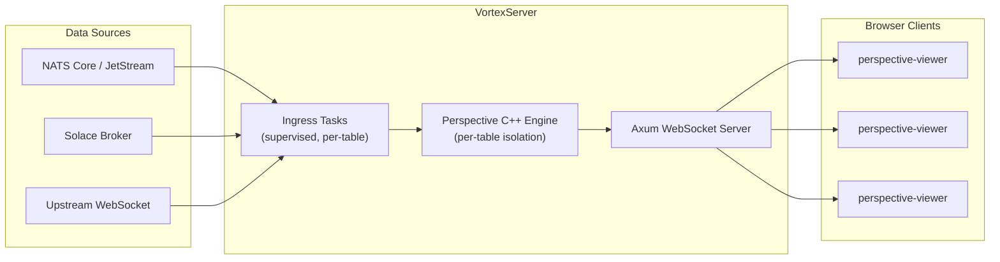
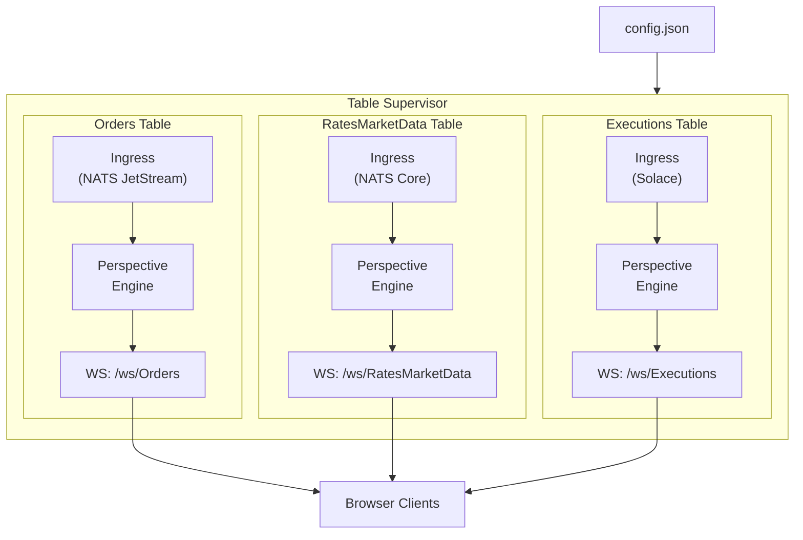
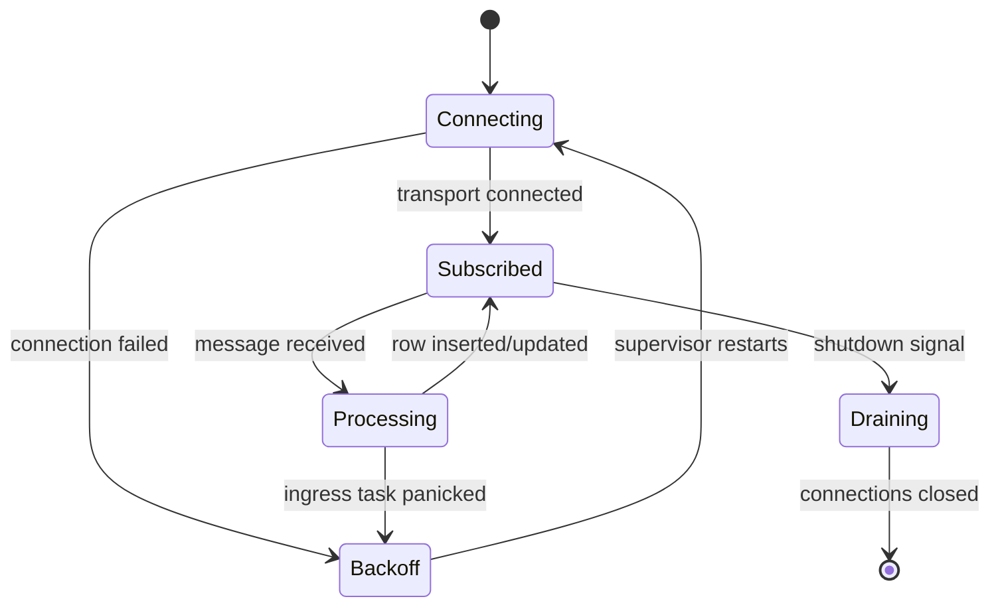

# VortexServer

High-performance WebSocket server for real-time data visualization, built on [Perspective](https://perspective.finos.org/) (engine **v5.3.1**, vendored under `Vortex/`) and [Axum](https://github.com/tokio-rs/axum).

VortexServer ingests streaming data from multiple transport protocols (NATS, Solace, WebSocket) and serves it to browser clients via `<perspective-viewer>` over WebSocket. Each table runs on an isolated C++ analytics engine instance with automatic supervision and restart.

## Features

- **Multi-transport ingress** — NATS Core, NATS JetStream, Solace, and upstream WebSocket
- **Per-table isolation** — each table gets its own Perspective engine and FFI mutex
- **Supervised ingress** — panicked ingress tasks auto-restart with backoff
- **Graceful shutdown** — Ctrl+C / SIGTERM drains connections cleanly
- **Structured logging** — JSON or pretty format, optional rotating file output
- **JSON configuration** — single config file with environment variable overrides

## Prerequisites

| Tool | Version | Required for | Notes |
|------|---------|----|-------|
| **Rust** | nightly-2026-01-01 | building vortex-server | Set automatically via `rust-toolchain.toml` (run `rustup show` to install) |
| **Conan** | 2.x | C++ deps for the Perspective engine | `pip install conan`; first build runs `conan install` automatically |
| **CMake** | 3.20+ | C++ build | |
| **C++ compiler** | C++17 | C++ build | Xcode (macOS), GCC/Clang (Linux), **MSVC 2022 with the “Desktop development with C++” workload** (Windows) |
| **Docker** | 20.x+ | running the bundled Solace test broker | Docker Desktop on macOS / Windows; Docker Engine on Linux. Compose v2 (`docker compose ...`) required. |
| **Python** | 3.10+ | running the Python simulators | Optional; only if you want to run `simulators/*/python/` |
| **Node.js** | 18+ | running the Node simulators | Optional; only if you want to run `simulators/*/nodejs/` |

The Solace transport links against `libsolclient` (Solace's official C
API). The `solace-rs` crate's build script downloads a pinned tarball
on first build — no manual install required, on any platform. To pin to
your own copy instead, set `SOLCLIENT_LIB_PATH=/path/to/lib` (containing
the static lib, named `libsolclient.a` on macOS/Linux or
`libsolclient_s.lib` on Windows) before `cargo build`, or
`SOLCLIENT_TARBALL_URL=...` to override the download URL.

### Platform-specific notes

- **macOS** (Intel or Apple Silicon): the standard Xcode Command Line
  Tools are sufficient. The Solace path links system Kerberos
  (`gssapi_krb5`) — already present on macOS by default.
- **Windows 10/11 (x86_64)**: install MSVC 2022 via the Visual Studio
  Installer with the "Desktop development with C++" workload checked
  (this also installs the Windows 10/11 SDK and CMake). Run all commands
  from PowerShell, **not** WSL — vortex-server's build is the native
  Windows build (`x86_64-pc-windows-msvc`). The bundled bash scripts
  (`scripts/*.sh`) are mirrored by PowerShell scripts (`scripts/*.ps1`);
  use the `.ps1` ones natively. Git for Windows is recommended for the
  `git` client.
- **Linux** (x86_64): need build-essential / gcc-c++, plus the
  `docker-compose-plugin` package if you want the broker. Distro
  packages of Conan are usually stale — install via pip.

## Quick Start

### macOS / Linux

```bash
# 1. Clone
git clone https://github.com/CapitalMarketsMacro/VortexServerRust.git
cd VortexServerRust

# 2. Build (first run downloads pre-built C++ deps via Conan + libsolclient,
#    then compiles the Perspective C++ bridge — ~5-10 min, cached after.
#    Needs gcc 13 / MSVC 2022 for the all-prebuilt path (apple-clang 17 on
#    macOS is partial); any other toolchain fails with "Missing binary"
#    unless PSP_CONAN_BUILD_MISSING=1 opts in to compiling C++ deps.)
cargo build

# 3. Copy and edit configuration
cp config.example.json config.json

# 4. Run
cargo run -p vortex-server
```

### Windows (PowerShell)

```powershell
# 1. Clone
git clone https://github.com/CapitalMarketsMacro/VortexServerRust.git
Set-Location VortexServerRust

# 2. Build — prebuilt Conan deps + C++ bridge; ~5-10 min first run, cached after
#    (MSVC 2022 / msvc 194 gives the prebuilt path; other toolchains need
#    PSP_CONAN_BUILD_MISSING=1 to compile the C++ deps from source)
cargo build

# 3. Copy and edit configuration
Copy-Item config.example.json config.json

# 4. Run
cargo run -p vortex-server
```

The server binds to `0.0.0.0:4000` by default. Connect a Perspective
viewer:

```javascript
const viewer = document.querySelector("perspective-viewer");
const ws = new perspective.WebSocketClient("ws://localhost:4000/ws");
const table = await ws.open_table("Orders");
await viewer.load(table);
```

> **Want to see data flow end-to-end without writing a publisher first?**
> The repo ships a Solace broker (`docker-compose.yml`) and per-transport
> data simulators (`simulators/`) with launch scripts on both platforms.
> See [Local Solace broker](#local-solace-broker) and
> [Data simulators](#data-simulators) below for the full demo recipe.

## Configuration

VortexServer uses a JSON config file (default: `config.json`). Override the path via CLI or environment variable:

```bash
cargo run -p vortex-server -- --config path/to/config.json
# or
VORTEX_CONFIG=path/to/config.json cargo run -p vortex-server
```

### Example Configuration

[`config.example.json`](config.example.json) at the repo root is a
complete, ready-to-run config wired to the bundled brokers and
WebSocket simulator — four tables (one per transport). Copy it to
`config.json` and run vortex-server as-is, no edits needed.

Top-level shape:

```jsonc
{
  "server":     { "bind": "0.0.0.0:4000", "ws_path": "/ws" },
  "logging":    { "level": "info", "format": "pretty", "dir": "logs", "file_prefix": "vortex-server" },
  "transports": {
    "nats":   { "url": "nats://localhost:4222", "name": "vortex-server", "credentials_file": null },
    "solace": { "host": "tcp://localhost:55554", "vpn": "default",
                "username": "default", "password": "", "client_name": "vortex-server" }
  },
  "tables": [
    { "name": "Orders", "index": "OrderId",
      "source": { "transport": "nats_jetstream", "stream": "ORDERS",
                  "subject": "orders.>", "consumer": "vortex-orders",
                  "format": "json_row" } }
    /* … one entry per table you want to serve; see the example file */
  ]
}
```

The field reference for each section follows below.

### Server

| Field | Default | Description |
|-------|---------|-------------|
| `bind` | `0.0.0.0:4000` | Address and port to listen on |
| `ws_path` | `/ws` | Base path for WebSocket endpoints |

### Logging

| Field | Default | Description |
|-------|---------|-------------|
| `level` | `info` | [tracing filter](https://docs.rs/tracing-subscriber/latest/tracing_subscriber/filter/struct.EnvFilter.html) string |
| `format` | `pretty` | `pretty` or `json` |
| `dir` | — | Directory for rotating log files (omit to disable file logging) |
| `file_prefix` | `vortex-server` | Log filename prefix |

### Tables

Each entry in the `tables` array creates a Perspective table exposed at `{ws_path}/{name}`.

| Field | Description |
|-------|-------------|
| `name` | Table name (becomes the WebSocket endpoint) |
| `index` | Primary key column for upserts. Requires a `source` (a static table has no schema to index) |
| `composite_index` | Array of columns forming a composite primary key |
| `stringify_columns` | Columns to treat as strings regardless of inferred type |
| `list_flatten` | How JSON *arrays* in other columns are ingested: `stringify` (default, stored as JSON text — no row multiplication), `zip` or `cartesian` (Perspective 5.x row expansion). Nested objects always need `stringify_columns` |
| `source` | Ingress configuration (see transports below) |

### Transport Types

**NATS Core** — subscribe to a subject on a NATS server:
```json
{ "transport": "nats_core", "subject": "rates.marketData", "format": "json_row" }
```

**NATS JetStream** — durable consumer on a JetStream stream:
```json
{ "transport": "nats_jetstream", "stream": "ORDERS", "subject": "orders.>", "consumer": "vortex-orders", "format": "json_row" }
```

**Solace** — direct-messaging topic subscription. One libsolclient session
per table (per-table isolation matching the rest of the server); reconnect
and subscription re-apply are handled inside libsolclient with our own
backoff wrapping the initial connect:
```json
{ "transport": "solace", "topic": "executions/>", "format": "json_row" }
```

Guaranteed/persistent delivery (queue or topic-endpoint binding) is not
yet wired up — see `src/ingress/solace.rs` for the scope notes. To run a
local broker for development, use the bundled docker-compose file (see
below) and point the `transports.solace.host` at `tcp://localhost:55554`.

**WebSocket** — connect to an upstream WebSocket feed (the bundled
`config.example.json` points at `ws://localhost:8765/ticks` so the
included WS simulator works out of the box; swap in your real endpoint
for production):
```json
{ "transport": "websocket", "endpoint": "ws://localhost:8765/ticks", "format": "json_row" }
```

## Architecture

### Data Flow Overview


```mermaid
flowchart LR
    subgraph Sources["Data Sources"]
        NATS["NATS Core / JetStream"]
        Solace["Solace Broker"]
        WSUp["Upstream WebSocket"]
    end

    subgraph Vortex["VortexServer"]
        direction TB
        Ingress["Ingress Tasks\n(supervised, per-table)"]
        Engine["Perspective C++ Engine\n(per-table isolation)"]
        Axum["Axum WebSocket Server"]
        Ingress --> Engine --> Axum
    end

    subgraph Clients["Browser Clients"]
        V1["perspective-viewer"]
        V2["perspective-viewer"]
        V3["perspective-viewer"]
    end

    NATS --> Ingress
    Solace --> Ingress
    WSUp --> Ingress
    Axum --> V1
    Axum --> V2
    Axum --> V3
```

### Per-Table Isolation

Each configured table runs as an independent pipeline with its own engine instance, ingress task, and supervisor. A failure in one table does not affect others.


```mermaid
flowchart TB
    Config["config.json"] --> Supervisor

    subgraph Supervisor["Table Supervisor"]
        direction LR
        subgraph T1["Orders Table"]
            I1["Ingress\n(NATS JetStream)"] --> E1["Perspective\nEngine"] --> WS1["WS: /ws/Orders"]
        end
        subgraph T2["RatesMarketData Table"]
            I2["Ingress\n(NATS Core)"] --> E2["Perspective\nEngine"] --> WS2["WS: /ws/RatesMarketData"]
        end
        subgraph T3["Executions Table"]
            I3["Ingress\n(Solace)"] --> E3["Perspective\nEngine"] --> WS3["WS: /ws/Executions"]
        end
    end

    WS1 & WS2 & WS3 --> Browser["Browser Clients"]
```

### Ingress Lifecycle


```mermaid
stateDiagram-v2
    [*] --> Connecting
    Connecting --> Subscribed: transport connected
    Connecting --> Backoff: connection failed
    Subscribed --> Processing: message received
    Processing --> Subscribed: row inserted/updated
    Processing --> Backoff: ingress task panicked
    Backoff --> Connecting: supervisor restarts
    Subscribed --> Draining: shutdown signal
    Draining --> [*]: connections closed
```

## Project Structure

```
src/                       — VortexServer application
  main.rs                  — Entry point
  config.rs                — JSON config + env overrides
  ingress/                 — Per-transport consumers (NATS, Solace, WebSocket)
  supervisor.rs            — Panic-respawning task wrapper
  tables.rs                — TableSlot: one Perspective engine per table
  transform.rs             — Row transforms (stringify nested, composite PK)
  logging.rs               — Structured logging setup
Cargo.toml                 — Workspace root + vortex-server package
config.example.json        — End-to-end example: one table per transport
rust-toolchain.toml        — Pinned nightly toolchain
docker-compose.yml         — Solace broker for local testing
scripts/                   — Cross-platform broker + simulator launchers
  solace.{sh,ps1}          — Manage the Docker Solace broker
  sim-<transport>-<lang>.{sh,ps1}  — 12 simulator launchers
simulators/                — Synthetic-data publishers (Python + Node)
  README.md                — Detailed simulator docs and payload schemas
  nats/{python,nodejs}/    — NATS Core + JetStream publisher
  solace/{python,nodejs}/  — Solace REST messaging publisher
  websocket/{python,nodejs}/  — WebSocket server (vortex connects to it)
Vortex/                    — Perspective engine dependency (C++ + Rust bindings)
  crates/
    perspective/           — Facade crate (re-exports client/server, Axum WS handler)
    perspective-client/    — Protocol definitions (protobuf), Arrow types, Client/Session/Table/View
    perspective-server/    — C++ engine bridge (FFI, build.rs + CMake + Conan)
  examples/axum-server/    — Standalone example with simulated Treasury bond data
  build.sh / build.bat     — Full C++ + Rust build scripts (rarely needed)
```

## Build Commands

```bash
# Full C++ + Rust build (first run ~5-10 min: prebuilt Conan deps + C++ bridge; cached after)
cd Vortex && ./build.sh      # Linux/macOS
cd Vortex && build.bat       # Windows

# Rust-only rebuild (after C++ is already built)
cargo build

# Release build (optimized for size: LTO, stripped symbols)
cargo build --release

# Run the server
cargo run -p vortex-server

# Run the example (simulated Treasury bond data)
cargo run -p perspective-axum-example

# Run tests
cargo test
cargo test -p perspective --features axum-ws        # engine-level: two clients, on_update
cargo test -p vortex-server --test ws_roundtrip     # Perspective Client over a real Axum WebSocket

# Probe a RUNNING server over its WebSocket (hosted tables, row count, schema;
# --watch N re-reads the row count every second so live ingress is visible)
cargo run --example ws_probe -- ws://127.0.0.1:4000/ws/Orders Orders --watch 5

# Format and lint
cargo fmt
cargo clippy
```

## Local Solace broker

A `docker-compose.yml` and a pair of cross-platform helper scripts
(`scripts/solace.sh` for macOS/Linux, `scripts/solace.ps1` for Windows)
are included for running a single-node Solace PubSub+ broker locally.
The scripts share one command surface: `start`, `stop`, `status`, `logs`,
`restart`.

### 1. Install Docker

Docker Desktop ships both `docker` and `docker compose` v2; Linux users
who prefer the engine-only install also need the compose plugin. The
broker image is ~1.5 GB, so allow some disk and memory headroom (we
recommend at least 4 GB RAM dedicated to Docker).

| OS | Install path | Verify |
|---|---|---|
| **macOS** (Intel or Apple Silicon) | Download Docker Desktop from <https://www.docker.com/products/docker-desktop/>, drag `Docker.app` to `/Applications`, launch it, accept the EULA. Wait for the whale icon in the menu bar to stop animating. | `docker version && docker compose version` |
| **Windows 10 / 11** (x86_64) | Download Docker Desktop from <https://www.docker.com/products/docker-desktop/>. The installer enables the WSL2 backend automatically — accept all defaults. Reboot when prompted. | In PowerShell: `docker version; docker compose version` |
| **Linux** (Debian/Ubuntu) | Easiest: `curl -fsSL https://get.docker.com \| sh`, then `sudo usermod -aG docker $USER` and log out/in. Or follow the distro-specific instructions at <https://docs.docker.com/engine/install/>. Make sure `docker-compose-plugin` (or `docker-ce-cli`'s built-in `compose` subcommand) is present. | `docker version && docker compose version` |

The scripts refuse to run if Docker isn't installed or the daemon isn't
reachable, so it's safe to run them before you've got everything
configured.

### 2. Start the broker

```bash
# macOS / Linux
./scripts/solace.sh start

# Windows (PowerShell)
.\scripts\solace.ps1 start
```

First start takes 30–90 seconds: Docker pulls
`solace/solace-pubsub-standard` (~1.5 GB once), then waits for the
broker's SEMP healthcheck to flip to ready. Subsequent starts are
~10 seconds. When the script returns, it prints the live endpoints.

### 3. Operate it

| Action | macOS / Linux | Windows |
|---|---|---|
| State + endpoints | `./scripts/solace.sh status` | `.\scripts\solace.ps1 status` |
| Tail logs | `./scripts/solace.sh logs` | `.\scripts\solace.ps1 logs` |
| Stop (keep state) | `./scripts/solace.sh stop` | `.\scripts\solace.ps1 stop` |
| Stop AND wipe state | `./scripts/solace.sh stop --wipe` | `.\scripts\solace.ps1 stop -Wipe` |
| Restart | `./scripts/solace.sh restart` | `.\scripts\solace.ps1 restart` |

Persisted state lives in the `vortex-solace-storage` Docker
volume — `stop` preserves it (queues, configuration, message backlog),
`stop --wipe` deletes the whole volume.

### 4. Use it

Endpoints exposed on `localhost`:

- **SMF** `tcp://localhost:55554` — what `vortex-server`'s Solace
  ingress connects to (port 55555 inside the container is remapped
  because macOS reserves 55555 host-side, and we keep the same mapping
  everywhere for parity)
- **SMF/TLS** `tcps://localhost:55443`
- **REST messaging** `http://localhost:9000` — one-shot publishes via
  `curl`
- **PubSub+ Manager (web UI)** <http://localhost:8080> — login
  `admin` / `admin`

Once the broker is up, `cargo run -p vortex-server` will pick up the
Solace block in `config.json` and start subscribing. To publish a test
message from the host:

```bash
curl -u default: -H 'Content-Type: application/json' \
  -X POST -d '{"ExecId":"E1","price":100.5,"qty":10}' \
  http://localhost:9000/TOPIC/executions/test
```

Solace's REST gateway wraps text payloads in an SDT-string envelope on
the SMF side, which the Solace ingress detects and unwraps automatically
(via `solClient_msg_getBinaryAttachmentString`), so the same code path
also accepts raw-binary publishes from native SMF clients.

## Local NATS broker

The same `docker-compose.yml` also ships a NATS service (`nats:alpine`
with JetStream enabled and persistent storage), independent of the
Solace one — start whichever you need. A pair of helper scripts mirrors
the Solace pattern: `scripts/nats.sh` for macOS/Linux,
`scripts/nats.ps1` for Windows.

```bash
# macOS / Linux
./scripts/nats.sh start              # ~5s to healthy
./scripts/nats.sh status             # client port + JetStream summary
./scripts/nats.sh logs               # tail
./scripts/nats.sh stop               # preserve JetStream data
./scripts/nats.sh stop --wipe        # also wipe the volume

# Windows (PowerShell) — identical surface
.\scripts\nats.ps1 start
.\scripts\nats.ps1 status
.\scripts\nats.ps1 logs
.\scripts\nats.ps1 stop
.\scripts\nats.ps1 stop -Wipe
```

Endpoints once running:

- **Client connections** `nats://localhost:4222` — vortex-server's NATS
  ingress and the NATS simulators connect here
- **HTTP monitoring** <http://localhost:8222> — `/varz` for server stats,
  `/jsz` for JetStream introspection, `/healthz` for readiness probes

JetStream data persists in the `vortex-nats-storage` Docker
volume across `stop`/`start`, so a stream + messages remain after a
restart. `stop --wipe` removes the volume so the next start is a clean
slate.

The NATS JetStream simulators create the `ORDERS` stream on first run if
it doesn't already exist (idempotent), so once the broker is up you can
go straight to publishing without any manual SEMP/CLI setup.

## Data simulators

`simulators/` contains synthetic-data publishers for every transport, in
both Python and Node.js (pick whichever runtime is already installed).
Each one emits rows whose schema matches the corresponding table in
`config.example.json`, so they're immediately usable by a Perspective
viewer:

| Transport | Vortex table | What the simulator does | Default endpoint |
|---|---|---|---|
| NATS Core | `RatesMarketData` | Publish JSON rows with nested Bid/Ask ladders | `nats://localhost:4222` (subject `rates.marketData`) |
| NATS JetStream | `Orders` | Publish JSON order rows on `orders.<symbol>`; creates the `ORDERS` stream on first run | `nats://localhost:4222` |
| Solace | `Executions` | Publish JSON execution rows via Solace REST messaging | `http://localhost:9000` (topic `executions/test`) |
| WebSocket | `MarketTicks` | Run a WebSocket *server* that streams JSON ticks to anyone who connects | `ws://localhost:8765/ticks` |

Twelve launch scripts (six bash + six PowerShell mirrors) sit under
`scripts/sim-<transport>-<lang>.{sh,ps1}`. Each one lazily creates the
per-simulator dependency tree (`.venv/` for Python, `node_modules/` for
Node) on first invocation, then execs the entry point with every CLI
flag forwarded through.

### Common flags

The same flags work on every simulator, in both runtimes:

| Flag | Default | Effect |
|---|---|---|
| `--rate-ms=N` | `200` | Inter-message delay (≈ 5 msg/s by default) |
| `--count=N` | `0` | Stop after N messages (`0` = run forever) |
| `--seed=N` | random | Deterministic payload PRNG seed for reproducible runs |

### macOS / Linux

```bash
# NATS Core (publishes rates.marketData; needs the bundled NATS broker)
./scripts/sim-nats-py.sh                       # Python
./scripts/sim-nats-js.sh                       # Node

# NATS JetStream — auto-creates the ORDERS stream on first run
./scripts/sim-nats-py.sh --mode=jetstream
./scripts/sim-nats-js.sh --mode=jetstream

# Solace (needs the bundled Solace broker)
./scripts/sim-solace-py.sh
./scripts/sim-solace-js.sh

# WebSocket server (no broker needed; vortex-server connects to it)
./scripts/sim-ws-py.sh
./scripts/sim-ws-js.sh
```

### Windows (PowerShell)

```powershell
.\scripts\sim-nats-py.ps1
.\scripts\sim-nats-js.ps1 --mode=jetstream
.\scripts\sim-solace-py.ps1
.\scripts\sim-solace-js.ps1
.\scripts\sim-ws-py.ps1
.\scripts\sim-ws-js.ps1
```

See `simulators/README.md` for the per-simulator payload schemas,
transport-specific flags, and notes on what's intentionally minimal.

## Full local stack

A complete end-to-end demo — broker, server, and one simulator per
transport — wired through the bundled `config.example.json`:

**macOS / Linux**

```bash
# Terminal 1 — start both brokers (Solace ~60s, NATS ~5s)
./scripts/solace.sh start
./scripts/nats.sh start

# Terminal 2 — vortex-server (the bundled example is pre-wired to point at
# the bundled brokers and the WS simulator's local endpoint — no edits needed)
cp config.example.json config.json
cargo run -p vortex-server -- --config config.json

# Terminal 3 — WebSocket simulator (vortex-server connects to it)
./scripts/sim-ws-py.sh

# Terminal 4 — Solace simulator (publishes executions/test → Executions table)
./scripts/sim-solace-py.sh

# Terminals 5 + 6 — NATS simulators (point at the bundled NATS broker)
./scripts/sim-nats-py.sh                       # rates.marketData → RatesMarketData
./scripts/sim-nats-py.sh --mode=jetstream      # orders.<symbol> → Orders
```

**Windows (PowerShell)**

```powershell
# Terminal 1
.\scripts\solace.ps1 start
.\scripts\nats.ps1 start

# Terminal 2 — example config is pre-wired to the bundled brokers + WS sim
Copy-Item config.example.json config.json
cargo run -p vortex-server -- --config config.json

# Terminal 3
.\scripts\sim-ws-py.ps1

# Terminal 4
.\scripts\sim-solace-py.ps1

# Terminals 5 + 6
.\scripts\sim-nats-py.ps1
.\scripts\sim-nats-py.ps1 --mode=jetstream
```

Once all are running, the server logs should show `seeded` and continuous
`apply` activity for every active table. Connect a `<perspective-viewer>`
to `ws://localhost:4000/ws/<TableName>` to view live data.

## Platform Support

| Platform | Architecture | Status |
|----------|-------------|--------|
| macOS | ARM64 (Apple Silicon) | Supported |
| macOS | x86_64 | Supported |
| Linux | x86_64 | Supported |
| Windows | x86_64 | Supported |

C++ dependencies are downloaded as **pre-built binaries** via Conan 2 —
nothing compiles from source. The exact, all-prebuilt dependency graph is
pinned in `Vortex/crates/perspective-server/conan.lock`. Pre-built binaries
are toolchain-specific, so the fast (no-source-compile) path needs **gcc 13**
on Linux, **MSVC 2022 (msvc 194)** on Windows, or **apple-clang 17** on macOS;
on any other toolchain the build fails with a clear `Missing binary` error
unless `PSP_CONAN_BUILD_MISSING=1` opts in to compiling the C++ deps from
source (macOS coverage is partial: protobuf, abseil, re2 and libbacktrace
have no apple-clang 17 binaries at the time of writing). See CLAUDE.md →
"C++ dependencies: pre-built only".

Once the Conan cache is warm (after the first build, or with a restored
`~/.conan2` on CI) the build resolves everything from the cache with **no
network access at all** — `build.rs` tries a `--no-remote --build=never`
install first and only falls back to ConanCenter if something is missing.
Set `PSP_CONAN_NO_REMOTE=1` to make that fallback an error for strictly
offline builds.

Note that the pre-built Arrow ships without its CSV module, so CSV ingest
and CSV export are compiled out of the engine: feed tables JSON rows,
JSON columns, NDJSON or Arrow IPC (which is what every ingress path here
does anyway).

## License

Apache-2.0
